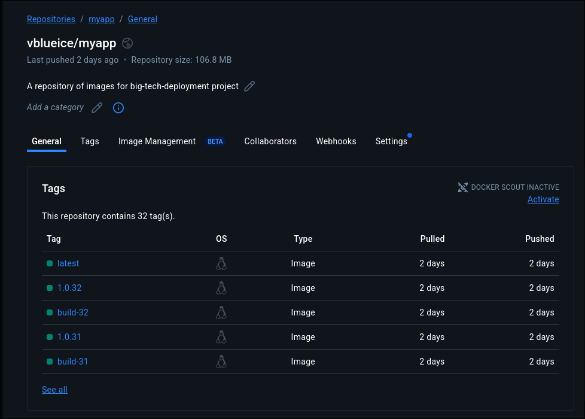

# Production-Grade CI/CD Pipeline with Environment Separation

A hands-on DevOps project demonstrating enterprise-level deployment practices used by big tech companies. This project implements a complete CI/CD pipeline with automated builds, environment separation, health checks, and rollback mechanisms.

[](https://github.com/Sanket399/big_tech_deployment/actions)

## 📋 Table of Contents
- [Project Overview](#-project-overview)
- [Architecture](#-architecture)
- [Features](#-features)
- [Tech Stack](#-tech-stack)
- [Pipeline Workflow](#-pipeline-workflow)
- [What I Learned](#-what-i-learned)
- [Future Roadmap](#-future-roadmap)

---

## Project Overview

This project was created to understand how modern tech companies deploy applications at scale. Instead of just reading documentation, I tried to build a production-ready CI/CD pipeline from scratch, implementing:

- **Multi-environment deployment** (Staging → Production)
- **Automated testing and health checks**
- **Rollback mechanisms** for failed deployments
- **Version tracking** with semantic versioning
- **Manual approval gates** for production

---

## Architecture

```
┌─────────────┐
│   GitHub    │
│  Repository │
└──────┬──────┘
       │ Push to main
       ▼
┌─────────────────────────────────┐
│   GitHub Actions (Self-Hosted)  │
│                                  │
│  1. Build Docker Image          │
│  2. Tag (semantic + build)      │
│  3. Push to Docker Hub          │
│  4. Create Git Tag              │
└────────────┬────────────────────┘
             │
             ▼
    ┌────────────────┐
    │  Docker Hub    │
    │  Image Registry│
    └────────┬───────┘
             │
             ▼
┌────────────────────────────────┐
│         Target VM              │
│  (192.168.56.101)              │
│                                │
│  ┌──────────────────────────┐ │
│  │  Staging Environment     │ │
│  │  Port: 8081              │ │
│  │  Container: myapp-staging│ │
│  └──────────┬───────────────┘ │
│             │                  │
│             ▼                  │
│      Health Check              │
│             │                  │
│             ▼                  │
│   Manual Approval Required     │
│             │                  │
│             ▼                  │
│  ┌──────────────────────────┐ │
│  │  Production Environment  │ │
│  │  Port: 8080              │ │
│  │  Container: myapp-prod   │ │
│  └──────────────────────────┘ │
└────────────────────────────────┘
```

---

## Features

###  Automated CI/CD
- **Trigger**: Automatic on push to `main` or `feature/env-separation`
- **Self-hosted runner**: Runs on the deployment VM
- **Multi-stage pipeline**: Build → Staging → Production

###  Docker Image Management
- **Semantic versioning**: `1.0.{build_number}`
- **Build tracking**: `build-{build_number}`
- **Latest tag**: Always points to newest build
- **Immutable deployments**: Each build is a unique artifact

###  Staging Environment
- **Port**: 8081
- **Purpose**: Test deployments before production
- **Health checks**: Automated validation via `/health` endpoint
- **Automatic rollback**: Reverts to previous version on failure

###  Production Environment
- **Port**: 8080
- **Manual approval gate**: Requires explicit approval before deployment
- **Only deploys tested builds**: Must pass staging first
- **Automatic rollback**: Recovers from failed deployments

###  Safety Mechanisms
-  Health check validation
-  Automatic rollback on failure
-  Manual production approval
-  Version tracking with Git tags
-  Environment isolation

---

##  Tech Stack

| Component | Technology |
|-----------|-----------|
| **Application** | Flask (Python) |
| **Containerization** | Docker |
| **CI/CD** | GitHub Actions |
| **Image Registry** | Docker Hub |
| **Runner** | Self-Hosted (on VM) |
| **Version Control** | Git + GitHub |
| **Deployment Target** | Single VM (Ubuntu) |

---

## Pipeline Workflow

### Stage 1: Build
```yaml
Trigger: Push to main
↓
Checkout code
↓
Set version variables (BUILD_VERSION, APP_VERSION)
↓
Login to Docker Hub
↓
Build Docker image
↓
Push with 3 tags (build, semantic, latest)
↓
Create Git tag for traceability
```

### Stage 2: Staging Deployment
```yaml
SSH into VM
↓
Stop/remove old staging container
↓
Pull new image (version-specific)
↓
Run staging container (port 8081)
↓
Wait 20 seconds for startup
↓
Health check: curl http://VM_IP:8081/health
↓
IF PASS: Continue to production
IF FAIL: Rollback to previous version
```

### Stage 3: Production Deployment
```yaml
IF staging passed
↓
Manual approval required
↓
Approved by designated approvers
↓
SSH into VM
↓
Stop/remove old production container
↓
Pull tested image (same as staging)
↓
Run production container (port 8080)
↓
IF FAIL: Automatic rollback to previous version
```

---

## 🎓 What I Learned

### Technical Skills
- ✅ CI/CD pipeline design and implementation
- ✅ Docker image versioning strategies
- ✅ Environment separation best practices
- ✅ Automated testing and health checks
- ✅ Rollback mechanisms and disaster recovery
- ✅ GitHub Actions workflows and self-hosted runners
- ✅ SSH automation for deployments

### DevOps Principles
- **Immutable infrastructure**: Replace, don't modify
- **Environment parity**: Staging mirrors production
- **Fail fast**: Catch issues before production
- **Automation**: Reduce human error
- **Observability**: Health checks are critical
- **Safety nets**: Always have a rollback plan

### Real-World Scenarios Handled
1. **Failed health check in staging** → Automatic rollback
2. **Deployment failure in production** → Automatic recovery
3. **Version tracking** → Git tags for audit trail
4. **Manual oversight** → Approval gates for critical changes

---

## 🗺️ Future Roadmap

### Phase 1: Kubernetes Integration (Next)

### Phase 2: Observability
### Phase 3: Security
### Phase 4: Advanced Features
- [ ] Blue-Green deployments
- [ ] Canary releases
- [ ] Horizontal Pod Autoscaling
- [ ] Helm charts for templating

##  License

This project is open source and available under the [MIT License](LICENSE).

## 📸 Screenshots

### GitHub Actions Pipeline


### Staging Deployment


### Production Approval


### Docker Hub Registry


### Rollback in Action


---

*Last Updated: October 2025*
